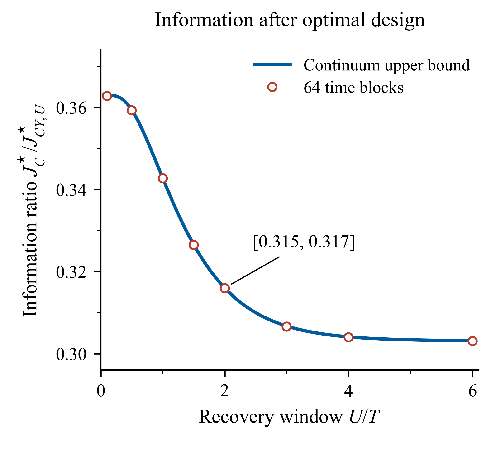

# Completed Price Tapes

Reproducible numerical example for **Completed Price Tapes Reduce Decision Complexity in AMM Execution**, by Jinrui Yang.

The example compares the information about a recovery parameter obtained from a scalar execution cost record and a completed price tape. Each observation model chooses its own calibration schedule. At a recovery window of twice the execution horizon, the numerical cost to tape information ratio is approximately **0.316**.



The blue curve evaluates an analytical upper bound over continuous controls. Circles show separate numerical optimization on 64 execution intervals. The bracket at $U/T=2$ displays numerically evaluated bounds rounded outwards to three decimals. The analytical inequalities and the numerical evaluation are explained in [METHODS](docs/METHODS.md).

## Start with the demonstration

Download the repository and open **[demo/index.html](demo/index.html)** in a browser. This English page works offline without Python. On GitHub, the link displays the HTML source. Download it before opening it locally.

Move the continuous recovery window slider to compare the two information amounts in a common unit. At $U/T=2$, the completed tape provides about **3.165 times** the numerical information of the cost record. At saved calculation nodes, the page shows the original separately optimized results. Between nodes, it linearly interpolates tape information with cost information fixed, then derives the ratio and its reciprocal from those amounts. A status label identifies computed nodes or the interpolation endpoints. Intermediate values are display interpolations. The page makes no optimization calls.

## Reproduce the calculation

Python **3.12** is recommended. The pinned environment below was tested with Python 3.12.7. Create and activate a virtual environment before installing dependencies.

```text
python -m pip install -r requirements.txt
python reproduce.py verify
python reproduce.py plot
python reproduce.py demo
```

`verify` recomputes information from saved controls and checks the model, feasibility, quadrature and plotted values. It writes a report to `output/verification.json`. `plot` exports PNG, PDF and editable SVG. `demo` draws the selected data and generates an offline page at `output/demo.html`.

To rerun the deterministic optimization and then inspect those fresh results:

```text
python reproduce.py compute
python reproduce.py verify --data-dir output
python reproduce.py demo --data-dir output
```

To run the full sequence:

```text
python reproduce.py all
python -m unittest discover -s tests -v
```

All paths are relative to this repository. `--data-dir` selects an input dataset and `--output-dir` selects a destination. Original saved results in `data/reference/` are kept separate from new calculations in `output/`. Run `python reproduce.py --help` for the command interface.

## What is computed?

The model uses execution horizon $T=1$, quantity $Q=1$, volatility $\sigma=1$, rate multiplier $R=2$ and independent cost noise $\tau=0$. The recovery rate is $\beta\in[0.5,2]$ and the unknown parameter is $\theta\in[-0.5,0.5]$. The density is

$$g_\theta(\beta)=\frac23\left[1+\theta\frac{5-4\beta}{3}\right].$$

The program represents a calibration schedule by executed quantities on equal time intervals. It evaluates Gaussian quadrature formulas and runs SLSQP from a fixed collection of initial schedules. The saved discrete calculations use 16, 32 and 64 intervals. A 128 interval cost candidate supports the separate continuous bound calculation.

The computation has two outputs with distinct meanings:

- **Numerical designs.** Feasible schedules found by deterministic local optimization provide the discrete comparison circles.
- **Continuous bounds.** Analytical inequalities apply to all admissible continuous schedules. Their formulas are evaluated numerically to generate the blue curve and the displayed bracket.

The derivation, quadrature rules, supporting envelope and pulse construction are given in [METHODS](docs/METHODS.md). Solver diagnostics and precision checks accompany the results. The reported bounds are numerical evaluations of analytical formulas, with their precision and interpretation explained in the methods.

This repository illustrates the paper's information comparison. Applying its decision complexity theorem to a particular recovery family also requires the optimizer regularity assumptions stated in the paper.

## Files

```text
reproduce.py                 Command line entry point
src/tape_example/            Model, optimization, bounds and presentation
data/reference/              Original saved controls and calculation results
docs/METHODS.md              Analytical and computational explanation
docs/VALIDATION.md           Numerical verification and tolerances
docs/figure1.*               Reproduced PNG, PDF and SVG
demo/index.html             English offline demonstration
tests/                      Automated numerical checks
requirements.txt            Tested dependency versions
.github/workflows/          Numerical checks and manual demo publication
```

### Fonts

The delivered figure uses Times New Roman, with STIX for additional mathematical symbols. The portable drawing default is **STIXGeneral**, supplied by Matplotlib. To reproduce the delivered font, install Times New Roman and run:

```text
python reproduce.py plot --font "Times New Roman"
python reproduce.py demo --font "Times New Roman"
```

A missing requested font raises an error. PDF embeds its font, while SVG keeps text editable and relies on the named font being installed when edited. No TeX installation is required.

## Automated checks and online demonstration

The verification workflow runs the tests and reevaluates saved controls on Python 3.12 for Windows and Linux. It runs when code is pushed to `main`, for pull requests and on manual request. Full numerical optimization is available through `python reproduce.py compute`.

The repository also includes a manually triggered **Publish demonstration** workflow. After enabling **GitHub Actions** as the Pages source in the repository settings, run this workflow from `main`. It publishes the self contained English page in `demo/`. The deployment result supplies the live address. See the [GitHub Pages instructions](https://docs.github.com/en/pages/getting-started-with-github-pages/using-custom-workflows-with-github-pages).

## Citation and license

Please cite the accompanying work using the metadata in [CITATION.cff](CITATION.cff). An arXiv identifier can be added after the preprint is announced.

Copyright 2026 Jinrui Yang. The code and materials in this repository are distributed under the [MIT License](LICENSE). The manuscript itself is not included in this repository.
